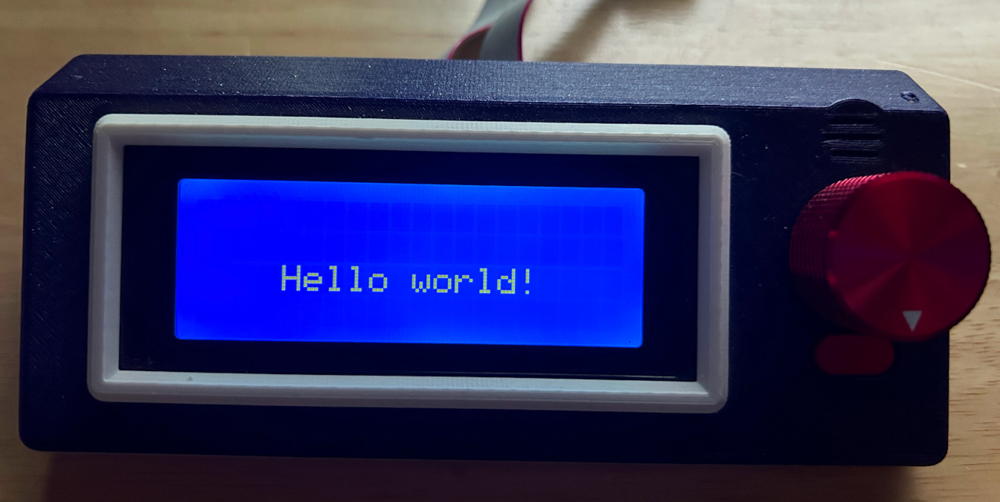

# pico-HD44780

A library for using LCDs powered by the HD44780 controller with
Raspberry Pi Pico

## Introduction

This library is designed to make use of an LCD driven by an
[HD44780](https://en.wikipedia.org/wiki/Hitachi_HD44780_LCD_controller) controller.
  The library
provides simple routines to initialize the LCD, clear the display, position the
cursor, and write strings to the display at the cursor position.

## Usage

### Create An Instance Of The HD44780 Class

All interaction with the LCD is done through an instance of the HD44780 class.
There are two constructors for creating this instance and the choice of
constructor determines the operating mode of the resulting object instance.

#### PIO mode

PIO mode makes use of the programmable IO (PIO) modules in the Raspberry Pi
Pico.  The CPU merely tells the PIO block what commands to execute and leaves
the PIO block to handle all of the pin level handshakes needed to execute
that command.  The CPU is free to do other work while this is happening.  The
ony downsides of this method are that it requires resources from the PIO
mdoules (one state machine and seven instructions) and that the GPIO pins
of the Pico used for RS and D[7:4] must be contiguous.  When possible PIO mode
should be used.  The constructor which supports PIO mode is:

    HD44780::HD44780(uint en, uint d4, PIO pio=pio0);
    en - GPIO number connected to the enable pin of the controller.
    d4 - GPIO number connected to the D4 pin of the controller.  The GPIO
         pins for D5, D6, D7, and RS are derived from this as they must be
         contiguous.  D5 = D4 + 1, ..., RS = D4 + 4
    pio - PIO to use.  It should be either pio0 or pio1.  This argument defaults
          to pio0 and thus may not need to be specified, but if it is
          specified, the hardware/pio.h file should be included to get the
          definitions for pio0 and pio1.

#### CPU mode

CPU mode uses the Pico to manage all interaction with the HD44780.  This is
less efficient than PIO mode as the Pico must spend a lot of time managing the
GPIO and sleeping to ensure timings are met.  It does however have the advantage
that any GPIO may be assigned to any pin on the HD44780 and does not use PIO
resources.  The constructor which supports CPU mode is:

    HD44780::HD44780(uint en, uint rs, uint d7, uint d6, uint d5, uint d4);
    en - GPIO number connected to the enable pin of the controller.
    rs - GPIO number connected to the RS pin of the controller.
    d7 - GPIO number connected to the D7 pin of the controller.
    d6 - GPIO number connected to the D6 pin of the controller.
    d5 - GPIO number connected to the D5 pin of the controller.
    d4 - GPIO number connected to the D4 pin of the controller.

### Initialize The Display

After creating an instance of the HD44780 class, the init method must be called.

    HD44780 hda44780(7, 2);
    hd44780.init();

This will set up everything needed to start using the display.

### Use The display

The remaining methods of hte HD44780 class are for manipulating the LCD and may
be called after initialization.

#### void HD44780::clear(void)

Clear the screen and move the cursor to the home position

#### void HD44780::home(void)

Move the cursor to the home position

#### void HD44780::position(uint row, uint col)

Move the cursor to the specified position

#### void HD44780::write_string(const char *str)

Display the specified string at the current cursor position

## Adding The Library To Your Project

Adding the library to a project is done with two CMake commands.  First the
directory containing the library must be added to the project using
[add_subdirectory()](https://cmake.org/cmake/help/latest/command/add_subdirectory.html)
If the path is relative, then a name for the directory used for compiling
sources must be provided (HD44780 is probably a good choice).  Following this
the library must beadded as a link target using
[target_link_libraries()](https://cmake.org/cmake/help/latest/command/target_link_libraries.html).
E.g.

    add_subdirectory(../.. HD44780)
    target_link_libraries(hello_lcd pico_stdlib HD44780)

## Compilation Flags

By default the library is compiled with both CPU and PIO mode support.
Theoretically memory space can be saved if only one mode is intended to be
used.  The variable HD44780_MODE may be set to "CPU", "PIO", or "CPU,PIO"
(the default) to control which modes are compiled into the library.  E.g.

    cmake -G "MinGW Makefiles" -DHD44780_MODE=PIO ..

## Examples

The examples subdirectly shows working cases for both PIO and CPU modes.

## Limitations

1. Communication is done using only the upper four bits of the data bus.  
  This is a supported mode of the HD44780 controller and should work fine even
  if the lower four bits are connected to the controller.  This eliminates the
  complexity of supporting both modes at the cost of efficiency (but see PIO
  mode if you really want to be efficient).
2. Only 5x8 font is currently supported.